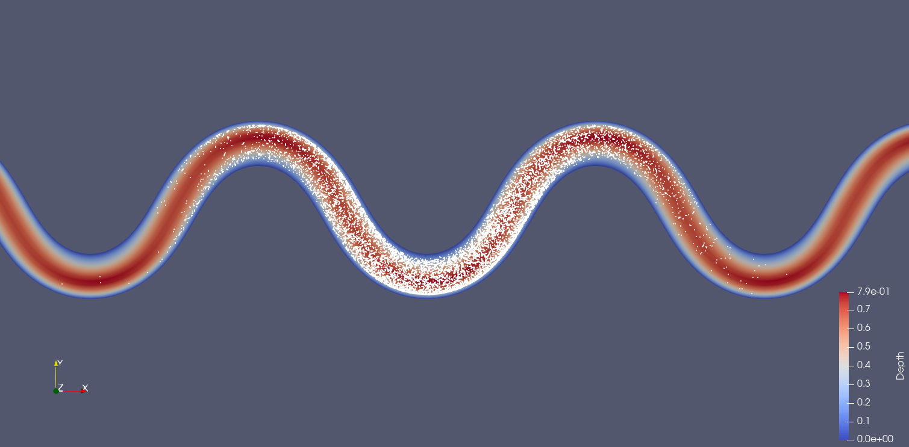
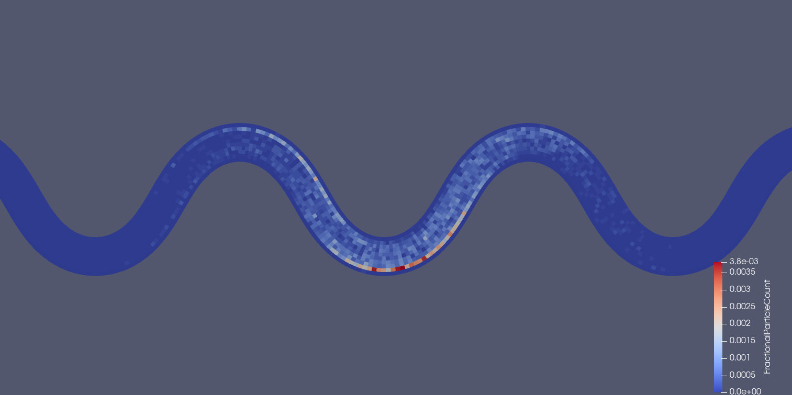
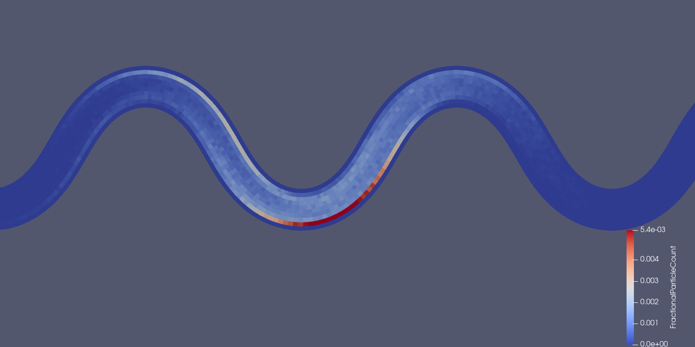

======================
Example
======================

.. role:: bash(code)
 :language: bash

.. role:: python(code)
 :language: python

This simulation example releases 1000 particles from a point-source in an idealized meandering river.

To run the example, copy the example options file given below into a new script and update the path to the *fluvial-particle* repository, then run in serial:

.. code-block:: bash

 fluvial_particle  path/to/options/file path/to/output/dir

Which prints to stdout:

.. code-block:: bash

 Beginning simulation
 Using seed 54059
 Simulating 1000 particles
 Particle class: Particles
 Velocity field will be interpolated from 3D grid
 Simulation start time is 0.0, maximum end time is 1000.0, using timesteps of 0.25 (all in seconds).
 Remaining time steps 3600/4000 || Elapsed Time: 0:00:02.532642 h:m:s || ETA 0:00:22.857252 h:m:s
 Remaining time steps 3200/4000 || Elapsed Time: 0:00:05.175054 h:m:s || ETA 0:00:20.732601 h:m:s
 Remaining time steps 2800/4000 || Elapsed Time: 0:00:07.856087 h:m:s || ETA 0:00:18.352711 h:m:s
 Remaining time steps 2400/4000 || Elapsed Time: 0:00:12.652966 h:m:s || ETA 0:00:18.999232 h:m:s
 Remaining time steps 2000/4000 || Elapsed Time: 0:00:16.042314 h:m:s || ETA 0:00:16.058364 h:m:s
 Remaining time steps 1600/4000 || Elapsed Time: 0:00:19.357288 h:m:s || ETA 0:00:12.918307 h:m:s
 Remaining time steps 1200/4000 || Elapsed Time: 0:00:22.243454 h:m:s || ETA 0:00:09.544262 h:m:s
 Remaining time steps 800/4000 || Elapsed Time: 0:00:25.076732 h:m:s || ETA 0:00:06.278982 h:m:s
 Remaining time steps 400/4000 || Elapsed Time: 0:00:27.967835 h:m:s || ETA 0:00:03.116172 h:m:s
 Remaining time steps 0/4000 || Elapsed Time: 0:00:30.928731 h:m:s || ETA 0:00:00.007734 h:m:s
 Finished simulation in 0:00:30.931503 h:m:s
 Post-processing...
 Finished in 0:00:30.968555 h:m:s

The output from the run can be visualized in Paraview by opening an XDMF file and reading it with the XDMF Reader. Here are the example outputs at t=500 seconds from the particles.xmf and cells2d.xmf files -- in the first image, the mesh is colored by flow depth:

Notice the discontinuous concentrations in the cells2d.xmf plot. Additional simulated particles will tend to generate smoother concentration distributions. For instance, here are the 2D concentrations using 100,000 particles instead of 1,000 (which takes ~100x as long to simulate):

Example options file
----------------------------

This file can be run in either serial or parallel execution mode. The input mesh data paths are relative to the repository root directory -- be sure to update :python:`"path/to/repo"` with the correct path on your machine.

.. code-block:: python

 """Options file for fluvial particle model."""

 # Required keyword arguments
 file_name_2d = "path/to/repo" + "//tests/data/Result_FM_MEander_1_long_2D1.vtk"  # path to 2D mesh file
 file_name_3d = "path/to/repo" + "//tests/data/Result_FM_MEander_1_long_3D1_new.vtk"  # path to 3D mesh file
 SimTime = 1000.0  # maximum simulation time [seconds]
 dt = 0.25  # simulation time step [seconds]
 PrintAtTick = 10.0  # Print every PrintAtTick seconds
 Track3D = 1  # 1 to use 3D velocity field, 0 to use 2D velocity field
 NumPart = 1000  # Number of particles to simulate per processor
 StartLoc = (6.14, 9.09, 10.3)  # Starting location from a single point
 ParticleType = Particles  # Particle type to simulate

 # Some optional keyword arguments
 lev = 0.00025  # reach-averaged lateral eddy viscosity
 # beta = (0.067, 0.067, 0.067)  # eddy viscosity coefficient
 # min_depth = 0.02  # minimum depth particles may enter [meters]
 # vertbound = 0.01  # depth fraction that bounds particles from bed and water surface
