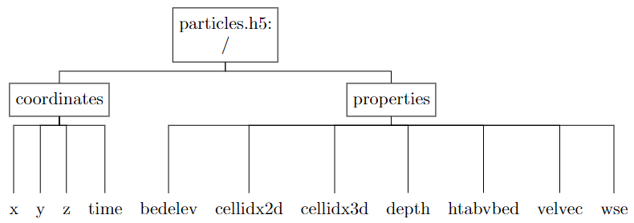
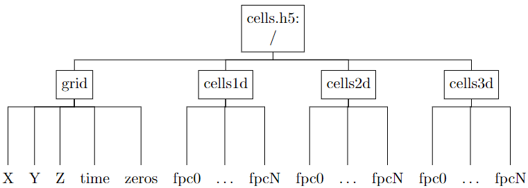

======================
Output
======================

Model output is written to two HDF5 files: particles.h5 and cells.h5. The particles.h5 file can be written to independently in parallel during an MPI-enabled run. The cells.h5 file is written by a single core in a post-processing routine using the data in particles.h5, so both files contain output from the same time step values. The files are organized similarly, with a single-level of groups in the root folder that hold either grid-related data or data defined over the grids. These data can be visualized with Paraview's XDMF Reader by reading the .xmf files that are also written during model execution.

HDF5 files
------------

particles.h5 file organization
~~~~~~~~~~~~~~~~~~~~~~~~~~~~~~~~~

The particles.h5 file contains the coordinates and interpolated quantities for each of the printing time slices. The dataset dimensions have sizes N\ :sub:`prints` (the total number of printing steps), and N\ :sub:`particles` (the total number of simulated particles). All of the datasets in particles.h5 are stored as NumPy 8-byte floating point numbers (i.e. np.float64 types) with the exception of cellidx2d and cellidx3d which are np.int64 data types.

The *particles.h5* file is organized as:

.. csv-table:: particles.h5 dataset descriptions
 :file: data/particles.csv
 :widths: 15, 20, 15, 50
 :header-rows: 1

cells.h5 file organization
~~~~~~~~~~~~~~~~~~~~~~~~~~~~~~~~~
The cells.h5 file contains particle concentrations (as a fraction of total simulated particles) in the cells of the input river curvilinear meshes. The dimensions of the meshes are (N\ :sub:`s`\ , N\ :sub:`n`\ , N\ :sub:`z`\ ), where N\ :sub:`s` is the number of nodes in the streamwise direction, N\ :sub:`n` is the number of nodes in the cross-stream direction, and N\ :sub:`z` is the number of nodes in the vertical. Note that the different array orderings in cells.h5 are necessary for visualizing with XDMF in Paraview. All of the datasets in cells.h5 are stored as NumPy 8-byte floating point numbers, i.e. np.float64 types. The fractional particle count data sets only store a single time slice each for reasons related to visualziation with XDMF.

The *cells.h5* file is organized as:

.. csv-table:: cells.h5 dataset descriptions
 :file: data/cells.csv
 :widths: 15, 20, 15, 50
 :header-rows: 1

XDMF files
--------------

To view the model output data in Paraview, read the XDMF files (.xmf extension) with Paraview's built-in "XDMF Reader." There are four files that describe model output defined on different spatial grids (but equivalent temporal grids): particles.xmf holds the time series of particle positions and fields interpolated from the grid nodes; cells1d.xmf holds the time series of quantities described at the 1D grid cell centers; cells2d.xmf and cells3d.xmf are the same with reference to the 2D and 3D grids. Each of the grids must be described in the .xmf files in terms of their topology, geometry, temporal organization, and dataset location. These files are generated automatically by *fluvial-particle* following the descriptions below.

A quick note: in what follows, the capitalized, italicized words refer to XDMF defined types. In particular, the use of *Attributes* in XDMF is different from the usage of "Attributes" in an HDF5 file.

The particles exist as points in a *Polyvertex* topology, with geometry described by the (x, y, z) positions of every particle at a given time step. Quantities interpolated from the grid fields, such as channel bed elevation and the velocity vector, are attached to the particles grid as *Attributes* at every defined time value. All of the particle data arrays are stored in 2D arrays with first dimension time and second dimension particles. These arrays are sliced into at each time index using the *HyperSlab* item type.

The cell-centered data are computed on 1D, 2D, and 3D grids (for a fully 3D simulation). These have (N_s), (N_s*N_n), (N_s*N_n*N_z) points, respectively, that define the extent of each cell in the structured curvilinear grids. The cell-centered datasets therefore have dimensions (N_s-1), (N_s-1,N_n-1), (N_s-1,N_n-1,N_z-1). An important note here is that in both the HDF5 and XDMF files, the arrays that define the grid points need to be ordered as (N_z, N_n, N_s) while the cell-centered data arrays need to be ordered as (N_s-1,N_n-1,N_z-1). I have not researched the details of why this is the case except that it is the same ordering of the grid and cell coordinates as returned from querying the VTK structured grid object that holds the field data.

A temporal collection grid is used to organize the time series in each of the cells .xmf files, in the same way that the particles .xmf file was organized. In the cell-centered cases, however, the grid is unchanging with time and is therefore defined once at the start of each file and then referenced at every time step.
The grids of the cells 2D and 3D .xmf files are defined similarly to each other by using the XDMF structured mesh topology types that implicitly define the ordering of and connections between cells with grid geometry from coordinates retrieved from the input VTK data files. While it also represents cell-centered data, the 1D .xmf file actually defines the grid with the *Polyvertex* topology type and node-centered *Attributes* for two reasons. First, a 1D structured mesh is not a pre-defined XDMF type. Second, loading the 1D data as point data in Paraview allows the use of filters that apply directly to points; for instance the *Point Line Interpolator* filter creates simple line charts from the field data defined at each point.

A note of caution: the *HyperSlab* item type doesn't always play nicely with Paraview, to which the numerous online forum posts on the subject can atest. It seems to work fine when used in the particles context on the *Polyvertex* topology type, and also on the cells 1D and 2D grid geometry definitions. Experience on this project indicates that it does not work well in the 2D and 3D cases when slicing into cell-centered *Attributes* inside of the temporal collection grid, i.e. when the HDF5 data are stored in one array that has an extra dimension for time. For this reason, the cell-centered data in the HDF5 file are written to a new dataset per time step so that the entire dataset can be loaded by Paraview at once.
