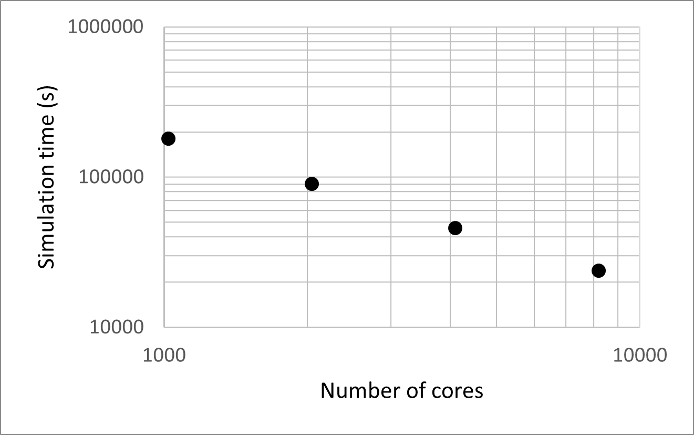
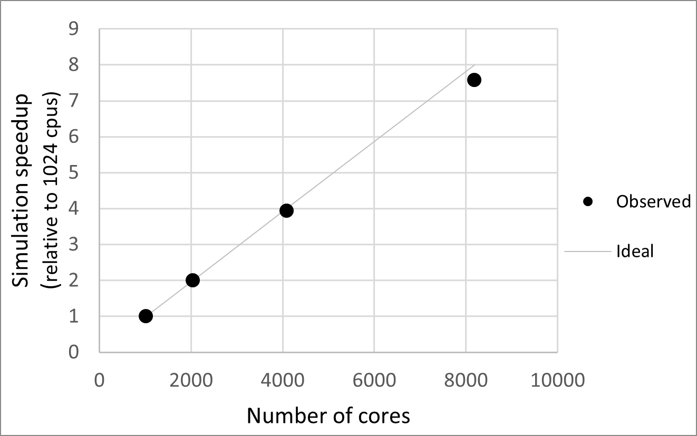
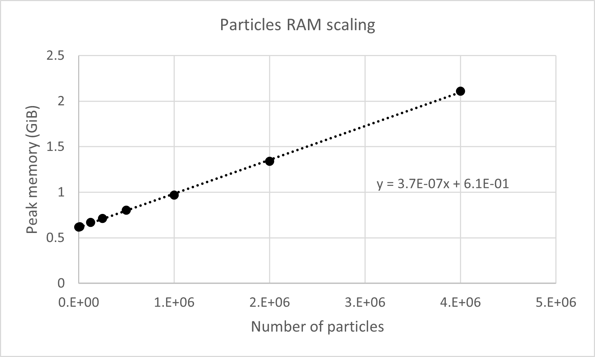
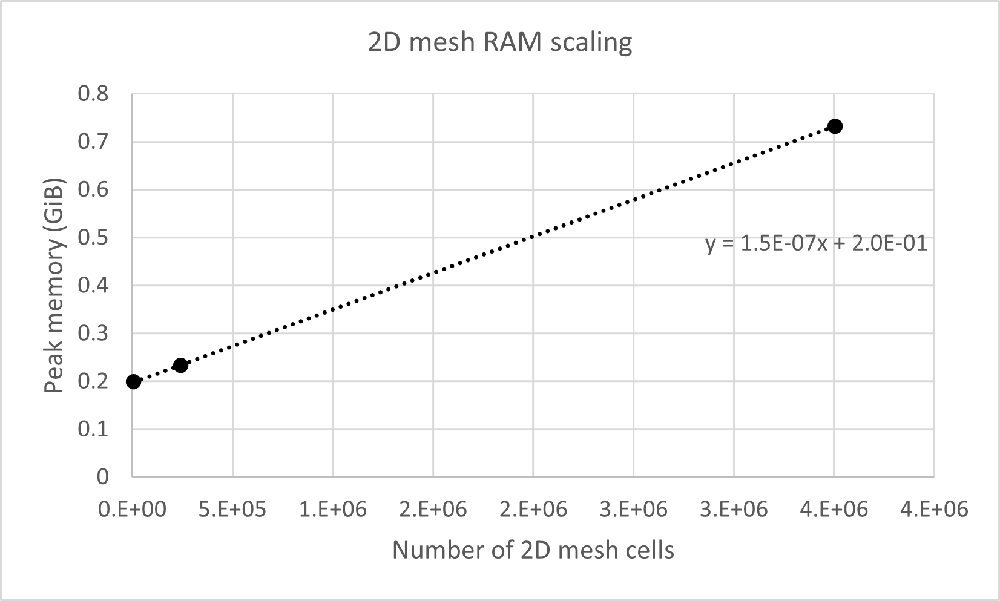
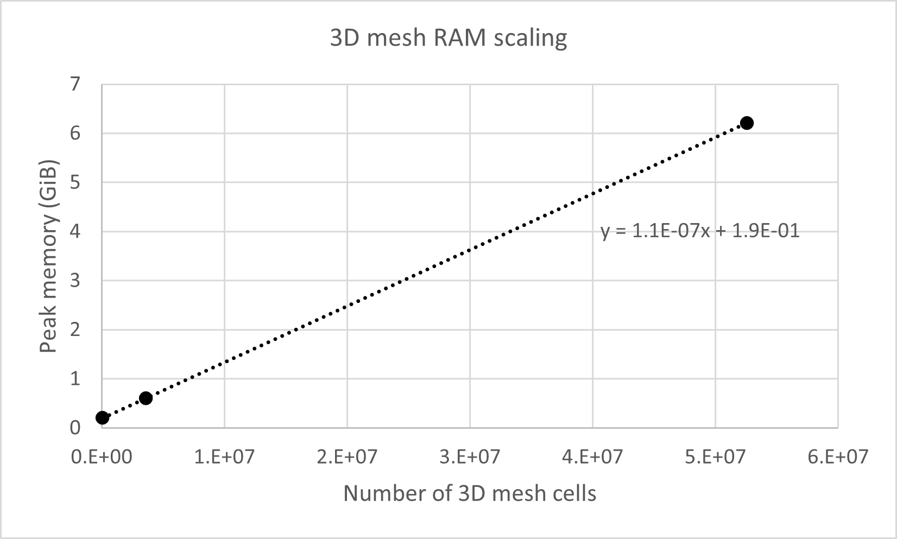
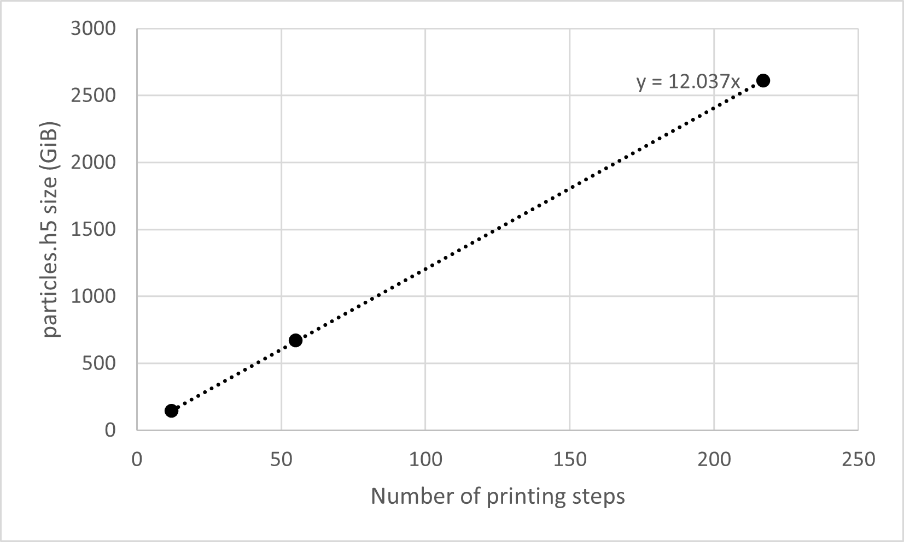
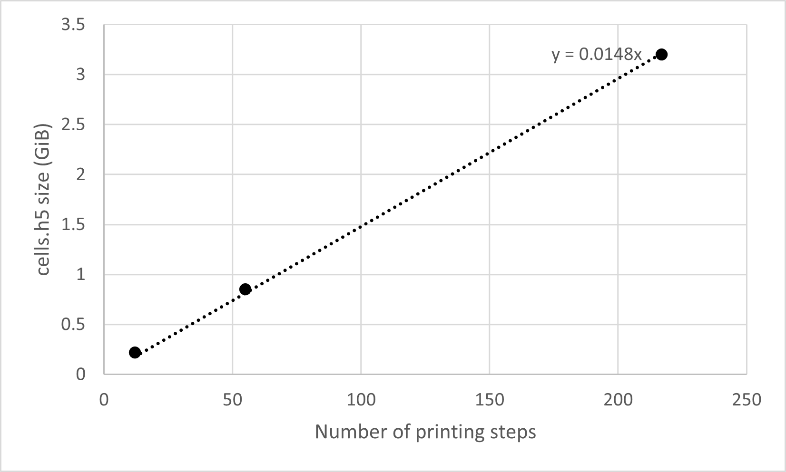

===================================
Scaling Guide
===================================

Parallel strong scaling
----------------------------------

For simulations over a large spatial or temporal domain, a large number of particles is needed to adequately resolve the particle concentrations. Consider the figure below. It shows a sequence of simulated particle density surfaces at the same time slice on the Kootenai River, Idaho, where each simulation uses a different number of particles. The left image shows the 2D output, and the right image shows the 3D surface and cross-sectional slice from the region outlined in the 2D image. Flow is from bottom to top.

As the number of simulated particles increases, the 3D distribution taken from near the particles' center of mass becomes continuous. The 2D distribution shows greater resolution as the number of particles increases, especially towards the tails of the distribution. For research in which capturing the distribution tails is important (e.g. river dye-dispersion studies), a sufficient number of particles must be used. Parallel execution with MPI enables greater particle concentration resolution without significantly increasing the total real-world execution time.

.. image::data/kootenai_decimate_particles_fpc.gif
    :alt: An animated image shows a 2D and 3D snapshot of the Kootenai River results over multiple simulations that use different numbers of particles

MPI-enabled installations may run simulations in parallel using a few cores on a laptop or thousands of cores on a supercomputer. A strong scaling experiment was conducted on the USGS Denali supercomputer using a fixed number of passive particles (:math:`2^{27}`). The particles were split evenly among 1024, 2048, 4096, and 8192 cores, and all simulations used the 3D Kootenai river mesh with identical simulation parameters. The first plot shows the time spent executing the main simulation loop, while the second shows the speedup calculated relative to the 1024 simulation.

Peak RAM usage
------------------------

The peak memory usage during a *fluvial-particle* simulation scales according to the number of simulated particles and the size of the river meshes. Use the rates below to predict an estimate for the peak memory usage of a simulation (per core), then add on ~0.2 GiB for background processes. For example, simulating 10\ :sup:`6` particles in a 3D mesh with 5*10\ :sup:`6` cells with would be expected to use:  (1.1*10\ :sup:`-7` GiB per cell) * (5*10\ :sup:`6` cells) + (3.7*10\ :sup:`-7` GiB per particle) * (10\ :sup:`6` particles) + 0.2 = 1.1 GiB

Peak memory usage increases with the number of simulated particles at a rate of 3.7 * 10\ :sup:`-7` GiB (0.397 KiB) per particle. This was determined from serial simulations on the 3D Kootenai River ranging from 10\ :sup:`3` to 10\ :sup:`7` passive particles.

In a 2D simulation with one simulated particle, the peak memory usage increases with the number of 2D mesh cells at a rate of 1.5 * 10\ :sup:`-7` GiB (0.161 KiB) per cell.

In a 3D simulation with one simulated particle, the peak memory usage increases with the number of 3D mesh cells at a rate of 1.1 * 10\ :sup:`-7` GiB (0.118 KiB) per cell. 3D simulations also use the same 2D meshes as the 2D simulations -- this rate includes the effects of the 2D mesh.

Output file sizes
-------------------

In addition to scaling with the number of mesh cells and the *total* number of particles (i.e. summed across all cores), the output HDF5 files also scale with the number of printing steps. The particles HDF5 file writes 12 1D arrays per printing time step, each of which store 8-byte numbers. The expected scaling relation of the file size :math:`S` (in bytes) with the total number of printing steps is therefore: 

.. math::
 S_{particles} = N_{particles}*12*8*N_{prints}

The cells HDF5 file writes three datasets per printing time step, one for each of the 1D, 2D, and 3D meshes. The expected relation follows, with :math:`N_{sc}` equal to the number of cells in the streamwise direction, :math:`N_{nc}` the number in the cross-stream direction, and :math:`N_{zc}` the number in the vertical:

.. math:: 
 S_{cells} = (N_{sc} + N_{sc}*N_{nc} + N_{sc}*N_{nc}*N_{zc})*4*N_{prints}

As an example, the plots below show the print-step scaling relations for both files from a 3D simulation of 2\ :sup:`27`\ passive particles on the Kootenai River with mesh cell dimensions :math:`N_{sc}=3008, N_{nc}=80, N_{zc}=15`. The expected scaling relations are thus :math:`S_{particles} = 12*N_{prints}` GiB and :math:`S_{cells} = 0.014*N_{prints}` GiB. These rate predictions which match those observed from the simulations.

When using 8,192 cores on Denali in the strong scaling experiment, the particles HDF5 file was larger than expected by several tens of GiBs, possibly due to increased metadata associated with dataset memory chunking.