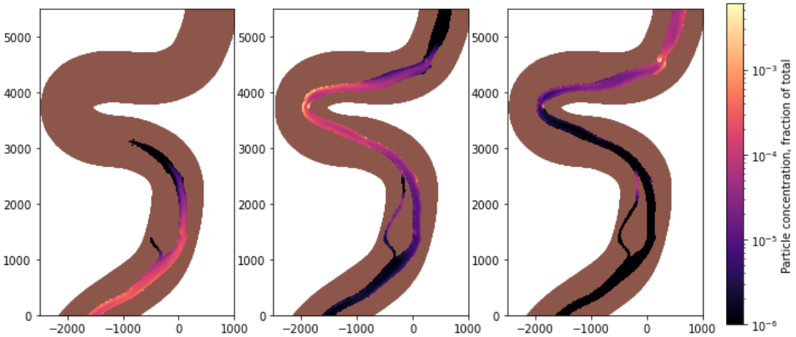

========================
Running fluvial-particle
========================

.. role:: bash(code)
 :language: bash

Quick Start
-----------

1. Generate a configuration template:

.. code:: bash

    fluvial_particle --init

This creates ``settings.toml`` in the current directory.

2. Edit the configuration file to specify your mesh files, particle settings, and field mappings.

3. Run the simulation:

.. code:: bash

    fluvial_particle settings.toml ./output

Command Line Usage
------------------

**Serial execution:**

.. code:: bash

 fluvial_particle <config_file> <output_directory>

Where ``<config_file>`` is the path to a TOML or Python configuration file, and ``<output_directory>`` is where output HDF5 and XDMF files will be written.

**Parallel execution (MPI):**

For an MPI-enabled installation, run in parallel (e.g., with 4 cores):

.. code:: bash

 mpiexec -n 4 fluvial_particle_mpi <config_file> <output_directory>

Command Line Options
--------------------

:bash:`--init`
    Generate a template configuration file in the current directory. Creates ``settings.toml`` by default.

:bash:`--format {toml,python}`
    Format for the template file (used with ``--init``). Default: ``toml``

    .. code:: bash

        # Generate TOML template (default)
        fluvial_particle --init

        # Generate legacy Python template
        fluvial_particle --init --format python

:bash:`--seed <int>`
    Specify the random seed for a serial simulation (does not apply to parallel simulations).

:bash:`--no-postprocess`
    Disable the post-processing routine that generates cells.h5 and cell XDMF files.

:bash:`--version`
    Display version information and exit.

:bash:`--help`
    Display help message and exit.

Python API
----------

For programmatic use in scripts or Jupyter notebooks:

.. code:: python

    from fluvial_particle import run_simulation, get_default_config

    # Option 1: Run from config file
    results = run_simulation("settings.toml", "./output")

    # Option 2: Run from dict config (no file needed)
    config = get_default_config()
    config["particles"]["count"] = 100
    config["grid"]["file_2d"] = "./mesh_2d.vts"
    config["grid"]["file_3d"] = "./mesh_3d.vts"
    results = run_simulation(config, "./output")

    # Access results
    positions = results.get_positions(timestep=-1)
    df = results.to_dataframe()

See the :doc:`example` page for detailed examples.
